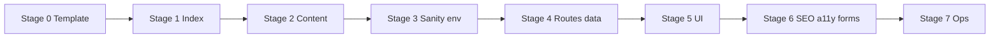

# Project index — multi-stage execution plan

This document is the **master checklist** for rebuilding Beringia Marine on a new template while preserving traceability. Execute stages **in order** unless noted; each stage has a clear **done** definition so work can pause between stages without losing context.

**Authoritative references**

| Resource | Use |
|----------|-----|
| `migration-legacy/INITIAL_NEXTJS_MIGRATION_ARCHIVE.md` | Prior app architecture, Sanity patterns, gaps |
| `migration-legacy/beringia/` | Staged copy, `config/*.json`, CMS notes, behavior reference |
| `migration-legacy/sanity-studio-snapshot/` | Studio schemas and desk structure |
| `migration-legacy/ENV_TEMPLATE.md` | Env var names for Sanity |

**Artifacts this plan produces**

- **`PROJECT_INDEX.md`** (create in **Stage 1**, maintain through **Stage 6**) — living map of routes, components, types, CMS, and config paths.
- **`docs/`** (optional per template) — deep-dives only when the template does not already cover them.

---

## How to use each stage

- **Goal** — One sentence.
- **Inputs** — What you need before starting.
- **Tasks** — Ordered checklist.
- **Deliverables** — Files or states that must exist.
- **Exit criteria** — Objective “done.”
- **Risks / notes** — Common pitfalls.

---

## Stage 0 — Baseline and template landing

**Goal:** A clean, runnable app in this repo with no Beringia-specific features yet.

**Inputs:** Chosen template (zip/git subtree/paste) and Node version aligned with template docs.

**Tasks**

1. Merge or paste the template into repo root; resolve duplicate `.gitignore` / `README.md` (keep root `README.md` short; link to this plan and `migration-legacy/`).
2. `npm install` / `pnpm install` as required; `dev` and `build` succeed with **no** Sanity or Beringia env vars yet.
3. Record **template stack** in `PROJECT_INDEX.md` § Stack (framework version, styling system, package manager, path aliases).
4. Decide **monorepo vs single app** for Studio: e.g. `cms/studio-*` beside `src/` or separate repo (document decision in `PROJECT_INDEX.md`).

**Deliverables:** Green `build`; `PROJECT_INDEX.md` stub with stack + repo layout only.

**Exit criteria:** Another developer can clone, install, run dev, and understand where the app lives.

**Risks:** Template overwriting root `README.md` — merge manually so `migration-legacy/` and `INDEX_PLAN.md` stay linked.

---

## Stage 1 — Living project index (navigation map)

**Goal:** A **thorough, navigable index** of everything that *will* exist—not necessarily implemented yet.

**Inputs:** Stage 0 complete; skim `migration-legacy/beringia/inventory/migration-inventory.md`.

**Tasks**

1. Create or expand **`PROJECT_INDEX.md`** with fixed sections (adjust headings to match template conventions):
   - **Quick navigation** — bullet links to app root, components, lib, types, CMS, public.
   - **Architecture** — data flow (Sanity → GROQ → server components), caching/ISR stance (TBD until Stage 4).
   - **Routes** — table: path | source (static/CMS) | primary types | notes.
   - **Components** — tree or table: name | path | server vs client | CSS approach | data dependencies.
   - **Types & contracts** — where shared TS types live; link to CMS-shaped types when added.
   - **Config & content** — mapping from `migration-legacy/beringia/config/*` and `copy/*` to **template destination** (e.g. MDX, JSON, CMS, env).
   - **Third-party** — fonts, analytics, Sketchfab, form provider (when chosen).
   - **Known gaps** — carry forward from archive (SEO, real contact, MediaGallery parity, asset recovery).
2. Add **`INDEX_PLAN.md`** and **`migration-legacy/`** to PROJECT_INDEX “Documentation” row.

**Deliverables:** `PROJECT_INDEX.md` is the **single entry point** for “where is X?”

**Exit criteria:** Every route you intend to ship appears in the Routes table, even as “not implemented.”

**Risks:** Drift—update `PROJECT_INDEX.md` at end of each later stage.

---

## Stage 2 — Content and design tokens (static layer)

**Goal:** Marketing copy and site chrome are **sourced consistently** (files or CMS), independent of Sanity client documents.

**Inputs:** `migration-legacy/beringia/copy/`, `migration-legacy/beringia/config/`, `component-patterns-reference.md`.

**Tasks**

1. For each page (Home, About, Contact, Terms), choose **storage**: file-based content, embedded in components, or future CMS type—**document in PROJECT_INDEX**.
2. Normalize **contact** and **legal** data: fix known inconsistencies (phone vs `tel:`, footer vs nav naming, terms typo) per `beringia/README.md`; do not reproduce bad data blindly.
3. Restore or replace **fonts and static assets** per `beringia/metadata/asset-inventory.md`; wire `public/` or CDN paths; note gaps in PROJECT_INDEX.
4. Map **design tokens** (colors, spacing, typography) from the archive into the template’s token system (CSS variables, Tailwind theme, etc.)—one source of truth only.

**Deliverables:** Pages render with real or placeholder content from the chosen layer; tokens documented in PROJECT_INDEX § Styling.

**Exit criteria:** No hardcoded strings that duplicate `beringia/config` without a documented mapping.

---

## Stage 3 — Sanity Studio and environment

**Goal:** Studio and app agree on **project ID, dataset, and schema**.

**Inputs:** `migration-legacy/sanity-studio-snapshot/`; `ENV_TEMPLATE.md`.

**Tasks**

1. Copy Studio into chosen location (e.g. `cms/studio-beringia-marine`); `npm install`; `sanity dev` works locally.
2. Align **`sanity.config.ts`** / `sanity.cli.ts` with deployment target (hosted Studio vs embedded).
3. Add root **`.env.example`** (committed) and local **`.env.local`** (ignored) with documented vars; never commit secrets.
4. Wire **CORS** / deployments if using hosted API from local Next (Sanity project settings).
5. Update PROJECT_INDEX § CMS with: schema file paths, document types, dataset name, where GROQ helpers will live.

**Deliverables:** Editors can create/publish `client` documents; env documented.

**Exit criteria:** `client` type matches archive expectations or intentional schema changes are listed in PROJECT_INDEX § Changelog / gaps.

**Risks:** Schema drift—if you change fields, update TypeScript types in Stage 4 in the same PR.

---

## Stage 4 — Data layer and routes (dynamic clients)

**Goal:** List and detail client pages load from Sanity with correct caching behavior.

**Inputs:** Archive § Data fetching and dynamic routes; `schemas/client.ts`.

**Tasks**

1. Add **`next-sanity`** (or template-preferred client) and implement **read-only** client in `src/lib/sanity.ts` (or equivalent): `fetchClients`, `fetchClientBySlug`, `getAllClientSlugs`—mirror archive GROQ or adjust with documented diff.
2. Configure **Next image** remote patterns for `cdn.sanity.io` (or `next.config` equivalent).
3. Implement routes:
   - `/clients` — listing;
   - `/clients/[slug]` — detail with `notFound()` on miss.
4. Decide **static generation vs dynamic**:
   - Prefer **`generateStaticParams` + `revalidate`** (e.g. 3600s) for new clients appearing without full redeploy—document interval and rationale in PROJECT_INDEX.
5. Add **TypeScript types** for GROQ results (or generated types if you adopt Sanity TypeGen later).
6. Optional: **`generateMetadata`** from Sanity `seo` fields (flagged as gap in archive)—schedule as Stage 6 if deferred.

**Deliverables:** All client slugs in Studio render; 404 for unknown slug; PROJECT_INDEX Routes table updated to “implemented.”

**Exit criteria:** Production build includes client routes without runtime env errors; ISR/static behavior matches documented choice.

---

## Stage 5 — UI parity (components and styles)

**Goal:** Chrome and client sections match **documented behavior**, using template primitives—not a line-by-line port of deleted CSS.

**Inputs:** `component-patterns-reference.md`; archive § Component structure.

**Tasks**

1. **Layout shell:** Header (scroll behavior, dropdown, mobile lock), Footer (visibility, columns), Hero—check against reference doc; list intentional deviations in PROJECT_INDEX.
2. **Client detail:** ClientNav (in-page sections / refs), Overview, SellingPoints (accordion, docs links), ValueProposition, MediaLinks, **MediaGallery** (rebuild using Gallery behaviors from archive—do not ship placeholder if marketing depends on it).
3. **Shared:** Modal/accessibility, loading and error UI for `/clients/[slug]`.
4. **Styling:** Co-locate styles per template convention; keep BEM naming only if it reduces churn—otherwise align to template.

**Deliverables:** COMPONENT_INDEX subsection in `PROJECT_INDEX.md` marked complete per feature; Storybook or visual checklist optional.

**Exit criteria:** Stakeholder walkthrough matches reference behaviors or signed-off exceptions exist in writing in PROJECT_INDEX § Decisions.

**Risks:** Interactive/demo sections (`useCases`, Sketchfab)—confirm with content whether required for MVP.

---

## Stage 6 — SEO, performance, accessibility, forms

**Goal:** Production-hardening and closure of archive-derived gaps.

**Tasks**

1. **SEO:** `metadata` / `generateMetadata`, Open Graph, canonical URLs; sitemap and robots if required.
2. **Performance:** Image sizes, lazy embeds, reduce client JS; verify Core Web Vitals on key pages.
3. **A11y:** Focus order, contrast, keyboard nav for Header/Modal/accordions.
4. **Contact:** Replace simulation with real submission (API route + provider, or server action)—document in PROJECT_INDEX.
5. **Legal / privacy:** Cookie/consent if needed for analytics or embeds.

**Deliverables:** Auditable checklist in PROJECT_INDEX § Launch criteria (or separate `docs/LAUNCH_CHECKLIST.md` if long).

**Exit criteria:** No P0 gaps from Stage 1 “Known gaps” list remain undocumented.

---

## Stage 7 — Operations and handoff

**Goal:** Repeatable deploys and low bus factor.

**Tasks**

1. CI: lint, typecheck, build; optional E2E smoke (home + one client slug).
2. Document **deploy** (Vercel/hosting), env vars per environment, Studio URL.
3. Tag a release; snapshot **Sanity dataset** or document backup procedure.
4. Optional: **CONTRIBUTING.md** pointing to `PROJECT_INDEX.md` and Stage 0–7 for onboarding.

**Exit criteria:** New contributor can go from clone to deploy using only repo docs + `PROJECT_INDEX.md`.

---

## Stage dependency overview

**Parallelism allowed:** Stage 2 (static content) and Stage 3 (Studio) can overlap **only** if `client` routes are not yet consuming marketing strings from the wrong source—use PROJECT_INDEX to avoid duplicate truth.

---

## Maintenance cadence (after Stage 7)

- On every meaningful PR: update **PROJECT_INDEX.md** (routes, components, or env).
- Quarterly: diff `migration-legacy/` against live behavior—archive is historical, not live spec.
- When schema changes: bump Stage 4 types and document in PROJECT_INDEX Changelog.

---

*This plan is executable in stages; complete exit criteria before moving on. For prior implementation details, see `migration-legacy/INITIAL_NEXTJS_MIGRATION_ARCHIVE.md`.*
